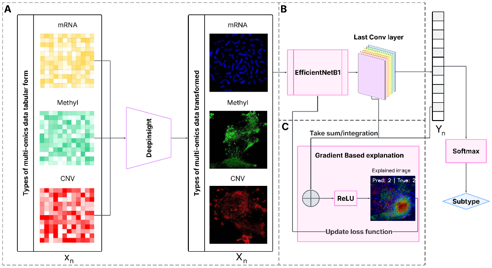
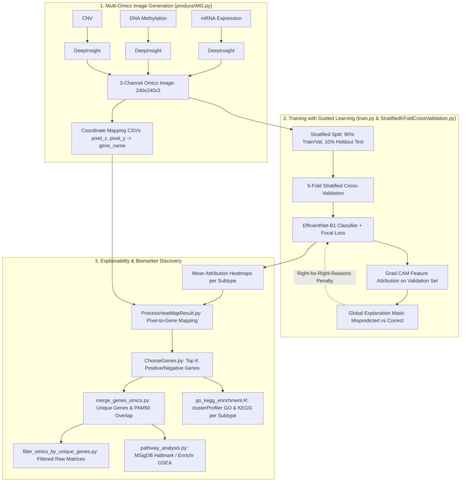

# DeepCamCS: Guided Learning with Grad-CAM for Multi-Omics Cancer Subtype Classification

An end-to-end deep learning and explainable AI (XAI) framework that transforms high-dimensional multi-omics data (mRNA, DNA Methylation, CNV) into structured multi-channel images, classifies cancer subtypes using EfficientNet-B1 with Focal Loss and Explanation-Guided Learning, and extracts biologically actionable biomarker genes and functional pathways.

---

## 📌 Table of Contents

- [Overview](#-overview)
- [Pipeline Architecture](#-pipeline-architecture)
- [Repository Structure](#-repository-structure)
- [Methodology Highlights](#-methodology-highlights)
  - [1. Multi-Omics to Image Transformation (Cart2Pixel & Snowfall)](#1-multi-omics-to-image-transformation-cart2pixel--snowfall)
  - [2. Model Architecture & Focal Loss](#2-model-architecture--focal-loss)
  - [3. Explanation-Guided Learning via Grad-CAM](#3-explanation-guided-learning-via-grad-cam)
  - [4. Post-Hoc Attribution & Biomarker Discovery](#4-post-hoc-attribution--biomarker-discovery)
- [Installation & Environment Setup](#-installation--environment-setup)
- [End-to-End Execution Guide](#-end-to-end-execution-guide)
  - [Step 1: Generate Multi-Omics Images](#step-1-generate-multi-omics-images)
  - [Step 2: Train with Stratified K-Fold CV & Guided Learning](#step-2-train-with-stratified-k-fold-cv--guided-learning)
  - [Step 3: Select Top Attributed Biomarker Genes](#step-3-select-top-attributed-biomarker-genes)
  - [Step 4: Merge Omics & Evaluate PAM50 Overlap](#step-4-merge-omics--evaluate-pam50-overlap)
  - [Step 5: Filter Raw Omics Matrices](#step-5-filter-raw-omics-matrices)
  - [Step 6: Biological Pathway Enrichment Analysis](#step-6-biological-pathway-enrichment-analysis)
  - [Step 7: GO & KEGG Functional Enrichment Analysis](#step-7-go--kegg-functional-enrichment-analysis)
- [Command-Line Arguments Reference](#-command-line-arguments-reference)
- [Expected Output Structure](#-expected-output-structure)

---

## 🔬 Overview

High-throughput multi-omics profiling offers comprehensive molecular views of cancer subtypes, but faces challenges from high dimensionality, sample scarcity, severe class imbalance, and "black-box" predictions. 

**DeepCamCS** addresses these challenges by:
1. **Representing Multi-Omics as Images:** Projects multi-omics modalities into 2D spatial layouts where each channel encodes a distinct modality (Channel 0: mRNA, Channel 1: DNA Methylation, Channel 2: Copy Number Variation).
2. **Integrating Explanation Feedback during Training:** Employs Grad-CAM feedback masks to penalize gradients in regions driving erroneous predictions ("Right for the Right Reasons" guided learning).
3. **Addressing Class Imbalance:** Uses multi-class Focal Loss and inverse class weighting to ensure robust performance on rare cancer subtypes.
4. **Translating Spatial Explanations to Biomarkers:** Reverse-maps high-attribution pixels to individual gene symbols across all omics channels, validating them against established cancer signatures (such as PAM50 for breast cancer) and biological hallmark pathways.

---

## 🏗 Pipeline Architecture

<p align="center">
  
</p>

*Figure 1: DeepCamCS framework architecture. **(A)** Tabular multi-omics profiles ($x_n$: mRNA, DNA Methylation, CNV) are transformed into structured 2D spatial multi-channel images ($X_n$). **(B)** An EfficientNet-B1 convolutional neural network extracts deep features from the last convolutional layer to classify cancer subtypes ($Y_n \to$ Softmax). **(C)** Gradient-based explanations (Grad-CAM) compute feature attributions from the last conv layer, generating explained attribution heatmaps and driving a guided-learning loss feedback loop to regularize model attention.*



---

## 📂 Repository Structure

| File | Description |
| :--- | :--- |
| `produceIMG.py` | Converts raw omics matrices (mRNA, Methylation, CNV) into 3-channel 2D spatial images using UMAP, minimum bounding rotated rectangle, and the fast Snowfall collision-resolution algorithm. Also exports coordinate lookup CSVs. |
| `Dataset.py` | PyTorch `Dataset` definition (`ImbalancedImageDataset`) supporting image loading, class-aware transforms, and label management. |
| `EfficientNetB1Classifier.py` | Transfer learning model wrapping `timm` EfficientNet-B1 backbone with custom dropout, dense classification head, and layer freeze/unfreeze methods. |
| `FocalLoss.py` | Multi-class Focal Loss implementation with class balancing weights ($\alpha$) and focusing parameter ($\gamma$) to handle severe class imbalance. |
| `GradCAM.py` | PyTorch Grad-CAM implementation capturing forward activations and backward gradients from convolutional feature maps (`conv_head`), generating single-image overlays and global validation feedback masks. |
| `additional_function.py` | Comprehensive evaluation and utility suite: dataset folder discovery, class weight calculation, multi-class confusion matrices, precision/recall/macro-F1/MCC/AUC calculations, and feature cluster metrics (ARI, DBI, Silhouette). |
| `StratifiedKFoldCrossValidation.py` | Complete cross-validation engine managing 5-fold CV, holdout test evaluation, learning rate scheduling (ReduceLROnPlateau), explanation-guided loss penalty injection, and metric logging. |
| `train.py` | Main pipeline CLI entry point: executes stratified cross-validation, generates performance curve figures, writes test result JSON, and triggers pixel-to-gene explanation mapping. |
| `ProcessHeatMapResult.py` | Processes Grad-CAM heatmaps: computes class-average heatmaps, identifies top 10% critical pixels, and maps pixel coordinates back to biological gene names across each omics modality. |
| `ChooseGenes.py` | Ranks and selects the top $K$ positive and negative attributed genes per cancer subtype based on median attribution scores. |
| `merge_genes_omics.py` | Aggregates selected genes across modalities, deduplicates them, and benchmarks overlap against the breast cancer PAM50 gold-standard gene panel. |
| `filter_omics_by_unique_genes.py` | Subsets original raw omics matrices (mRNA, CNV, Methylation) using the finalized list of unique biomarker genes. |
| `pathway_analysis.py` | Performs pathway enrichment analysis on extracted biomarker genes using `gseapy` / Enrichr (e.g., `MSigDB_Hallmark_2020`). |
| `go_kegg_enrichment.R` | Executes subtype-specific (or pooled) Gene Ontology (GO Biological Process) and KEGG pathway overrepresentation analysis via `clusterProfiler` with Benjamini-Hochberg FDR correction and dotplot visualizations. |

---

## 💡 Methodology Highlights

### 1. Multi-Omics to Image Transformation (Cart2Pixel & Snowfall)
Raw genomics data lack inherent spatial relationships. In `produceIMG.py`:
- High-dimensional gene features across samples are projected into 2D space via cosine metric **UMAP**.
- Coordinates are aligned using a **minimum rotated bounding rectangle** to maximize spatial utilization.
- Overlapping gene positions are resolved onto a discrete grid using the **Snowfall** breadth-first search (BFS) collision-handling algorithm.
- Gene expression/methylation/CNV values are mapped to pixels using `ConvPixel` with min-max and $\log(1 + x)$ scaling.
- mRNA (Red), Methylation (Green), and CNV (Blue) are stacked into a 3-channel image (default $224 \times 224$), preserving gene coordinate consistency across all samples.

### 2. Model Architecture & Focal Loss
- Backbone: `timm.create_model('efficientnet_b1', pretrained=True)`.
- Replaced classifier head: `nn.Sequential(nn.Dropout(p=dropout_rate), nn.Linear(in_features, num_classes))`.
- Training loss: **Focal Loss** to penalize easy negatives and focus on minority cancer subtypes:
  $$\mathcal{L}_{\text{Focal}} = -\alpha_t (1 - p_t)^\gamma \log(p_t)$$
  where $\alpha_t$ is inversely proportional to class frequencies.

### 3. Explanation-Guided Learning via Grad-CAM
To prevent the model from learning shortcut features or spurious image artifacts:
- During training, Grad-CAM extracts heatmaps on the validation set.
- A **global difference mask** is computed by contrasting misclassified sample heatmaps ($M_{\text{neg}}$) with correctly classified sample heatmaps ($M_{\text{pos}}$):
  $$\text{Mask} = \mathbb{I}(M_{\text{neg}} \le 0) - \mathbb{I}(M_{\text{pos}} \ge 0)$$
- An explanation regularization loss is incorporated into the total objective:
  $$\mathcal{L}_{\text{total}} = \mathcal{L}_{\text{Focal}} + \lambda_1 \cdot \frac{1}{|B|} \sum_{i \in B} \left\| \text{Mask} \odot \nabla_x \sum_c \log(p_c + \epsilon) \right\|_2^2$$
  This guides the network to reduce gradient sensitivity on regions associated with error-prone predictions.

### 4. Post-Hoc Attribution & Biomarker Discovery
- Pixel attributions from the best-performing models across folds are aggregated per predicted class.
- The `(pixel_x, pixel_y)` coordinates are cross-referenced with `gene_coordinates_{mRNA,Methylation,CNV}.csv` to assign attribution scores to individual genes.
- Biomarkers are ranked to identify subtype-specific drivers, validated against PAM50, and enriched for biological pathways using GSEA/Enrichr.

---

## ⚙️ Installation & Environment Setup

### Prerequisites
- Python 3.9+
- R 4.0+ (for Step 7 GO & KEGG enrichment analysis)
- CUDA-enabled GPU (recommended for EfficientNet training and Grad-CAM extraction)

### Install Dependencies

**Python packages:**
```bash
pip install torch torchvision --index-url https://download.pytorch.org/whl/cu118
pip install timm opencv-python numpy pandas matplotlib seaborn scikit-learn scipy shapely umap-learn imageio tqdm gseapy
```

**R packages (for Step 7):**
> *Note:* `go_kegg_enrichment.R` automatically checks and installs missing CRAN and Bioconductor packages on first run. You can also install them ahead of time:
```R
install.packages(c("dplyr", "ggplot2", "optparse", "BiocManager"))
BiocManager::install(c("clusterProfiler", "org.Hs.eg.db", "enrichplot"))
```

---

## 🚀 End-to-End Execution Guide

### Step 1: Generate Multi-Omics Images

Transform your aligned multi-omics matrices into 3-channel 2D images:

```bash
python produceIMG.py
```

> **Note:** Configure `base_dir`, `out_dir`, and input filenames in `produceIMG.py` (or modify to fit your data layout). This outputs:
> - `OutputData/train_val/{class_label}/sample_*.png`
> - `OutputData/test/{class_label}/sample_*.png`
> - `OutputData/gene_coordinates_{mRNA, Methylation, CNV}.csv`

---

### Step 2: Train with Stratified K-Fold CV & Guided Learning

Train the EfficientNet-B1 classifier with 5-fold cross-validation, holdout evaluation, and Grad-CAM attribution generation:

```bash
python train.py \
    --dataset_path "OutputData/train_val" \
    --coord_base "OutputData" \
    --output_dir "Explanation" \
    --model_name "EfficientNetB1Classifier" \
    --k_folds 5 \
    --num_epochs 50 \
    --batch_size 32 \
    --lr 0.0003 \
    --weight_decay 0.001 \
    --dropout_rate 0.6 \
    --focal_gamma 2.0 \
    --lambda1 0.1 \
    --lambda2 10 \
    --results_plot "imbalanced_kfold_comprehensive_results.png" \
    --test_results_json "fold_test_results.json"
```

**Key Outputs from Step 2:**
- `best_model_fold{0..4}.pth`: Checkpoints for the best model per fold.
- `confusion_matrix_fold{1..5}_test.png`: Test set confusion matrices.
- `imbalanced_kfold_comprehensive_results.png`: 9-panel loss and metric trajectories.
- `Explanation/mean_heatmap_class_{label}.png`: Class-average attribution maps.
- `Explanation/predicted_label_{label}_attribute_scores.csv`: Per-gene attribution scores.
- `Explanation/all_classes_attribute_scores.csv`: Master attribution table.

---

### Step 3: Select Top Attributed Biomarker Genes

Extract the top $K$ positive and negative attributing genes per cancer subtype:

```bash
python ChooseGenes.py \
    --base_dir "Explanation" \
    --k 400 \
    --output_dir "selected_genes_400"
```

**Outputs:**
- `selected_genes_400/predicted_label_{cls}_top_400_positive.csv`
- `selected_genes_400/predicted_label_{cls}_top_400_negative.csv`

---

### Step 4: Merge Omics & Evaluate PAM50 Overlap

Merge all top-ranked genes across modalities, deduplicate them, and evaluate overlap with the PAM50 breast cancer gene signature:

```bash
python merge_genes_omics.py \
    --folder "selected_genes_400" \
    --output_dir "Top"
```

**Outputs & Terminal Summary:**
- `Top/unique_genes_omics.csv`: Deduplicated `(unique_genes, omics_type)` pairs.
- Terminal log reporting total unique genes and detailed PAM50 overlap list.

---

### Step 5: Filter Raw Omics Matrices

Subset the original omics data matrices down to the extracted candidate biomarker genes:

```bash
python filter_omics_by_unique_genes.py \
    --unique_genes_file "Top/unique_genes_omics.csv" \
    --cnv_file "path/to/BRCA_CNV_aligned.csv" \
    --mrna_file "path/to/BRCA_mRNA_aligned.csv" \
    --methy_file "path/to/BRCA_Methy_aligned.csv" \
    --output_dir "Top"
```

**Outputs:**
- `Top/BRCA_CNV_aligned_filtered.csv`
- `Top/BRCA_mRNA_aligned_filtered.csv`
- `Top/BRCA_Methy_aligned_filtered.csv`

---

### Step 6: Biological Pathway Enrichment Analysis

Perform functional pathway enrichment analysis using Enrichr and MSigDB Hallmark gene sets:

```bash
python pathway_analysis.py \
    --gene_file "Top/unique_genes_omics.csv" \
    --gene_column "unique_genes" \
    --gene_set "MSigDB_Hallmark_2020" \
    --output_file "hallmark_pathway_overlap.csv"
```

**Outputs:**
- `hallmark_pathway_overlap.csv`: Table containing Term, overlap gene counts, adjusted p-values, and gene member lists.

---

### Step 7: GO & KEGG Functional Enrichment Analysis

Perform subtype-specific Gene Ontology (GO Biological Process) and KEGG pathway overrepresentation analysis using `clusterProfiler` with Benjamini-Hochberg FDR correction ($P_{\text{adj}} \le 0.05$).

Unlike Step 6 (which tests a single pooled list of genes across all classes), Step 7 runs **per subtype** directly on Step 3's top positive attributing genes (`predicted_label_{cls}_top_{k}_positive.csv`) to preserve subtype-specific biological signals:

```bash
# Default mode: Subtype-specific enrichment on top K positive genes
Rscript go_kegg_enrichment.R \
    --gene_dir "selected_genes_400" \
    --k 400 \
    --gene_column "gene_name" \
    --gene_set "BP" \
    --pvalue_cutoff 0.05 \
    --output_dir "GO_KEGG_Enrichment"
```

You can also run in `single_file` mode on the pooled gene list from Step 4 for comparison:

```bash
# Single file mode: Pooled enrichment across all subtypes
Rscript go_kegg_enrichment.R \
    --mode single_file \
    --gene_file "Top/unique_genes_omics.csv" \
    --gene_column "unique_genes" \
    --output_dir "GO_KEGG_Enrichment"
```

**Outputs:**
- `GO_KEGG_Enrichment/GO_BP_{subtype}.csv`: Significant GO Biological Process terms ($P_{\text{adj}} \le 0.05$).
- `GO_KEGG_Enrichment/KEGG_{subtype}.csv`: Significant KEGG pathways ($P_{\text{adj}} \le 0.05$).
- `GO_KEGG_Enrichment/GO_BP_{subtype}_dotplot.png`: Dotplots showing top enriched GO terms.
- `GO_KEGG_Enrichment/KEGG_{subtype}_dotplot.png`: Dotplots showing top enriched KEGG pathways.
- `GO_KEGG_Enrichment/go_kegg_enrichment_summary.csv`: Master summary table recording mapped genes and significant term counts across subtypes.

---

## 📋 Command-Line Arguments Reference

### `train.py`
| Argument | Type | Default | Description |
| :--- | :---: | :---: | :--- |
| `--dataset_path` | `str` | `...` | Root directory containing image class subfolders |
| `--coord_base` | `str` | `...` | Directory containing `gene_coordinates_*.csv` files |
| `--output_dir` | `str` | `Explanation` | Directory where heatmaps and attribution tables are saved |
| `--results_plot` | `str` | `...results.png` | Output path for the comprehensive 9-panel plot |
| `--test_results_json` | `str` | `fold_test_results.txt` | Path to save JSON evaluation results |
| `--model_name` | `str` | `EfficientNetB1Classifier` | Backbone architecture name |
| `--k_folds` | `int` | `5` | Number of folds for Stratified Cross-Validation |
| `--num_epochs` | `int` | `50` | Total training epochs per fold |
| `--freeze_epochs` | `int` | `0` | Epochs to train classifier head before unfreezing backbone |
| `--batch_size` | `int` | `32` | Training and validation batch size |
| `--lr` | `float` | `0.0003` | Initial learning rate |
| `--weight_decay` | `float` | `0.001` | AdamW optimizer weight decay |
| `--dropout_rate` | `float` | `0.6` | Dropout probability before classification layer |
| `--focal_gamma` | `float` | `2.0` | Focusing parameter $\gamma$ for Focal Loss |
| `--lambda1` | `float` | `0.1` | Penalty weight for explanation-guided loss |
| `--lambda2` | `float` | `10.0` | Secondary regularization coefficient |
| `--use_class_aware_aug` | `flag` | `False` | Enable class-aware data augmentation |
| `--use_weighted_sampling`| `flag` | `False` | Enable WeightedRandomSampler for batches |

### `go_kegg_enrichment.R`
| Argument | Type | Default | Description |
| :--- | :---: | :---: | :--- |
| `--mode` | `str` | `per_subtype` | Enrichment mode: `per_subtype` (processes each subtype file) or `single_file` |
| `--gene_dir` | `str` | `selected_genes_400` | Input directory containing `predicted_label_*_top_{k}_positive.csv` |
| `--k` | `int` | `400` | Number of top genes matching filenames in `ChooseGenes.py` |
| `--gene_file` | `str` | `Top/unique_genes_omics.csv` | Path to single gene CSV (used when `--mode single_file`) |
| `--gene_column` | `str` | `gene_name` | Name of the column containing gene symbols |
| `--gene_set` | `str` | `BP` | Gene Ontology domain: `BP` (Biological Process), `MF` (Molecular Function), or `CC` (Cellular Component) |
| `--organism` | `str` | `hsa` | KEGG organism code (`hsa` for Homo sapiens) |
| `--pvalue_cutoff`| `float` | `0.05` | Benjamini-Hochberg adjusted P-value significance threshold |
| `--output_dir` | `str` | `GO_KEGG_Enrichment` | Directory where enrichment tables, dotplots, and summary are saved |

---

## 📊 Expected Output Structure

```
.
├── Explanation/
│   ├── all_classes_attribute_scores.csv
│   ├── critical_pixels_class_*.csv
│   ├── mean_heatmap_class_*.png
│   ├── predicted_label_*_attribute_scores.csv
│   └── {cnv,methylation,mrna}_class_*.csv
├── GradCAM/
│   └── Fold_*/
│       └── sample_*_gradcam.png
├── selected_genes_400/
│   ├── predicted_label_*_top_400_negative.csv
│   └── predicted_label_*_top_400_positive.csv
├── Top/
│   ├── unique_genes_omics.csv
│   ├── BRCA_CNV_aligned_filtered.csv
│   ├── BRCA_mRNA_aligned_filtered.csv
│   └── BRCA_Methy_aligned_filtered.csv
├── GO_KEGG_Enrichment/
│   ├── GO_BP_*.csv
│   ├── GO_BP_*_dotplot.png
│   ├── KEGG_*.csv
│   ├── KEGG_*_dotplot.png
│   └── go_kegg_enrichment_summary.csv
├── best_model_fold*.pth
├── confusion_matrix_fold*_test.png
├── hallmark_pathway_overlap.csv
├── imbalanced_kfold_comprehensive_results.png
└── fold_test_results.json
```
